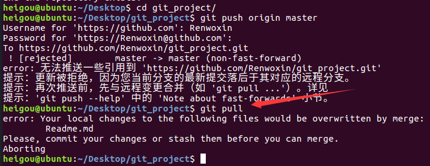
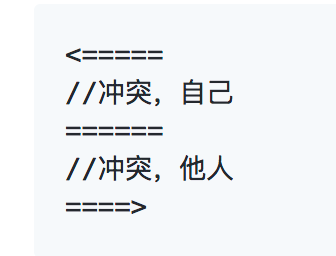

# git 学习与训练

## 情景一：

> 拿到一个份代码，需要将代码使用git进行管理，并且推送到github上。

+ 创建文件夹git_project
```
heigou@ubuntu:~/Desktop/git_exercise$ mkdir git_project
```

+  新建文件Readme.md，aa.py，bb.py
```
heigou@ubuntu:~/Desktop/git_exercise/git_project$ touch Readme.md
heigou@ubuntu:~/Desktop/git_exercise/git_project$ touch aa.py
heigou@ubuntu:~/Desktop/git_exercise/git_project$ touch bb.py
```

+ 使用vim编辑Readme.md添加以下内容

```
text
# README
aa.py
    print("This is aa")

bb.py
    print("This is bb")
```

```
1.heigou@ubuntu:~/Desktop/git_exercise/git_project$ vim Readme.md
2.键入“i”，切换到插入模式
  text
  # README
  aa.py
      print("This is aa")

  bb.py
      print("This is bb")
  ~
  ~                                                                              
3.输入完成后，输入“：”，编辑器下方会出现“：”，在输入“wq”保存并退出

```

+  使用重定向shell语句将
    + print("This is aa")写入aa.py
    + print("This is bb")写入bb.py

```
heigou@ubuntu:~/Desktop/git_exercise/git_project$ echo print\(\"This is aa\"\) > aa.py
heigou@ubuntu:~/Desktop/git_exercise/git_project$ cat aa.py
print("This is aa")

heigou@ubuntu:~/Desktop/git_exercise/git_project$ echo print\(\"This is bb\"\) > bb.py
heigou@ubuntu:~/Desktop/git_exercise/git_project$ cat bb.py
print("This is bb")
```

+ 在github上新建git_project项目，将本地项目在命令行进行上传
```shell
```


## 情景二：
> 模拟多人开发环境，解决提交代码冲突问题
+ 创建新用户xiaomin
``shell
sudo useradd -m xiaoming
``

+ 设置xiaoming用户密码
```shell
sudo passwd xiaoming
```

+ 切换用户
```shell
su xiaoming
```
+ 为小明用户配置git环境（ssh key添加到你的github账号里)
```shell
$ git config --global user.name "xm"
$ git init
```

+ 克隆git_project项目到
```shell
$ git clone https://github.com/Renwoxin/git_project.git
```

+ 修改Readme.md为：
```text
# README
this line is added by xiaoming
```

+ 提交小明的修改到github上，提交信息为"chang Readme.md by xiaoming"
```shell
$ git add .
$ git commit -m "chang Readme.md by xiaoming"
```

+ 切换用户到自己的用户(heigou)
```shell
重启切换
```
+ 修改Readme.md为：
```text
# README
this line is added by heigou
```
+ 提交修改
```shell
$ git add .
$ git commit -m "chang Readme.md by xiaoming"
```

+ 记录报错信息





+ 记录解决
办法
```text
```




heigou@ubuntu:~/Desktop/git_project$ git add .
heigou@ubuntu:~/Desktop/git_project$ git commit -m "chang Readme.md by heigou"
[master 8625636] chang Readme.md by heigou
heigou@ubuntu:~/Desktop/git_project$ git push origin master

+ 寻找避免此类问题发生的方法（合理的使用git进行开发的流程）
```text
在用户xiaoming下add、commit、push之后，如果切换用户add、commit、push，为了避免出错，那么在push之前务必pull
```

## 情景三：
> 合并分支

+ 在heigou用户下创建dev分支（development）分支
```shell
```

+ 查看当前分支，保证自己在master分支中
```shell
```

+ 修改aa.py，添加`print("this line is added by heigou")`
```shell
```
+ 提交修改到github
```shel;
```

+ 切换用户dev分支
```shell
```

+ 修改aa.py，修改`print("this line is added by heigou")`为`print("this line is changed by heigou")`
```shell
```

+ 提交修改到github
```text
```

+ 切换到master分支
```shell
```

+ 合并dev分支到master分支，记录报错信息
```shell
```

+ 记录解决方法
```shell
```

+ 合并完在提交github
``shell
``

## 情景四
> 一些零碎的技能

ignore`文件，实现文件或文件夹的过滤(
    + 自己举例子，文件和文件夹的例子都要有)
```shell
```

+ 放弃本次修改
    + 自己举例子
```shell
```

+ git diff 的使用（举例子）
    + 参考https://www.cnblogs.com/qianqiannian/p/6010219.html自己举例子
```shell
```

+ 查看远程所有分支（创建多分支，显示多分支）
```shell
```

+ 删除分支（举例子）
```shell
```

+ 版本回退（举例子，显示文件的前后变化）
```shell
```

+ 移除文件git rm的使用（举例子）
```shell
```

+ 远程仓库的移除与重命名（举例子）
```shell

```
